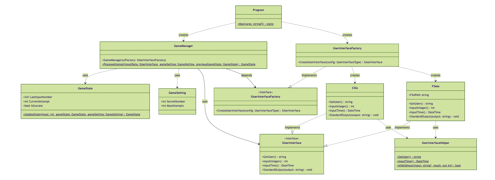

```
dotnet run
```

状態を更新するのではなく新しく生成しているので、スタックに配置するために構造体の方が良いかもしれない。

- 柔軟性を考えすぎると、コードは読みづらくなる。層ごとにコードを書いている人が違ってたくさんの人が書いているとかならあり。

- Domain層でゲームの状態と設定を定義して、Business層でそれら活用してゲームを管理する。

- Business層はPresentation層に依存しておらず、FactoryのInterfaceにのみ依存している。

- IUserInterfaceFactoryの実装がFactoryの実装（使い方）の説明になっているので、Business層側から簡単にFactroyを使うことができる。

- 新しいInterfaceが追加されるたびに、IUserInterfaceFactoryのenumを追加してFactoryでインスタンス作成を追加する（正直Factoryの実装はインスタンスを作っているだけで実装は簡単に把握できるのでInterfaceに分ける必要はなさそう。Interfaceを作るのは実装を把握する必要をなくすためなので、実装が簡単に把握できるFactoryとかはInterfaceにわける必要はなさそう。）

- こうすることで依存関係の逆転ができていて、Business層の実装を知らずにPresentation層に追加実装ができる（Presentation層側はInterfaceをoverrideするだけでいいし、Business側はInterfaceのメソッドを使っておけばいい。

- 右から左に向かって依存の流れができている（InterfaceとGameManagerはまとめて1つ考える）。


